[TOC]

# week3

> p9_卷积神经网络（CNN）
>
> p10_自注意力机制（Self_attention）

## p9_卷积神经网络（CNN）

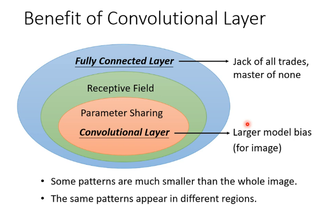

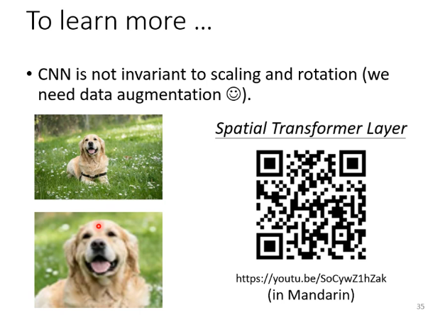

==transformer==

## P10_自注意力机制（Self_attention）上

### input

文本方式：

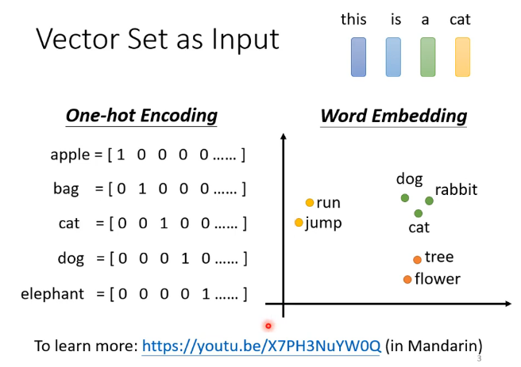

learn more: ==word Embedding==

语音方式：

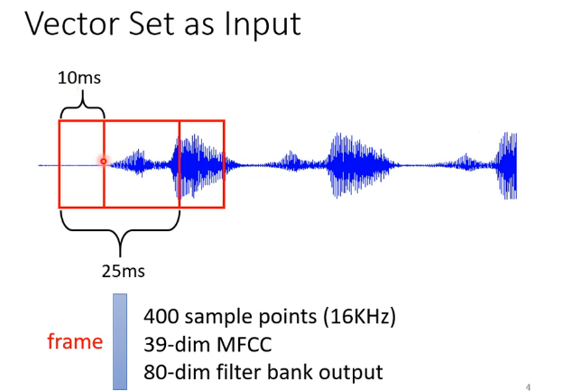

图（graph）方式：

每个node作为一个节点，用向量表示信息

### output

- 每个向量都有一个输出（输入输出数目一样的）

  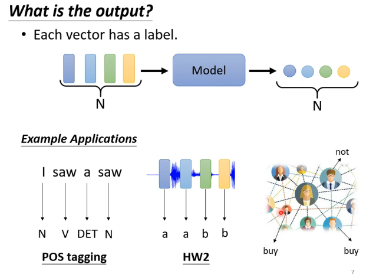

- 整个序列只有一个输出（类似分类问题）

  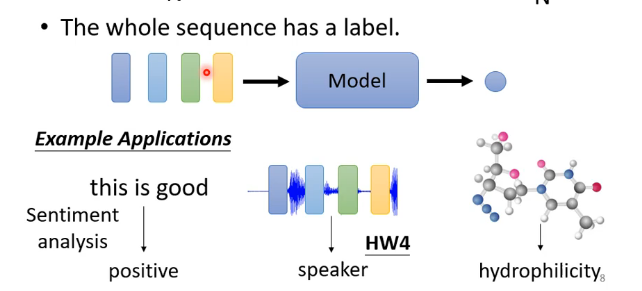

- 机器自己决定输出label的数量（seq2seq）

  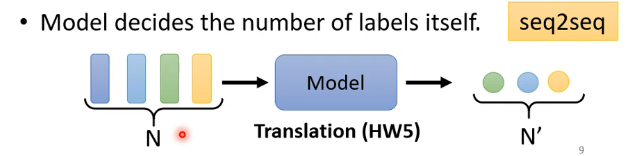

### self_attention

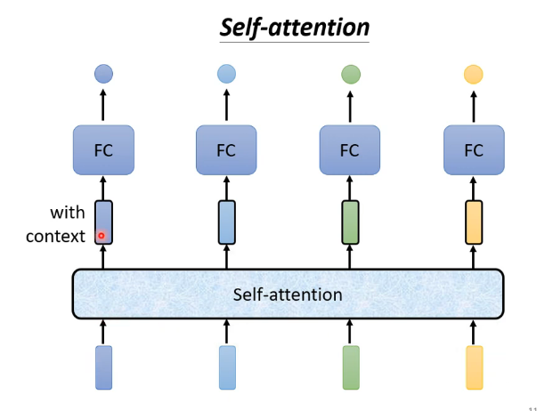

经过self_attention得到的输出，就考虑了整个seq的后得到的结果。

交替使用**self_attention**

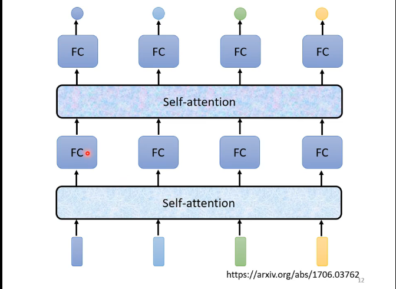

paper：Attention is all you need  http://arxiv.org/abs/1706.03762

**内部结构：**

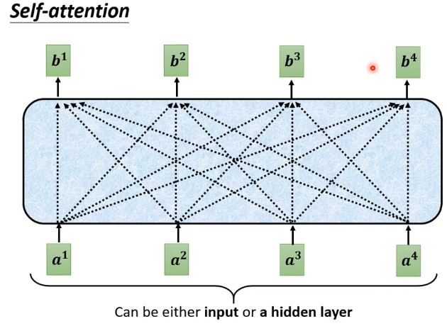

计算b^1^的过程：

- 根据a^1^这个向量，找出整个seq中哪个是最重要的，哪些跟判断a^1^是哪一个label是有关系的

  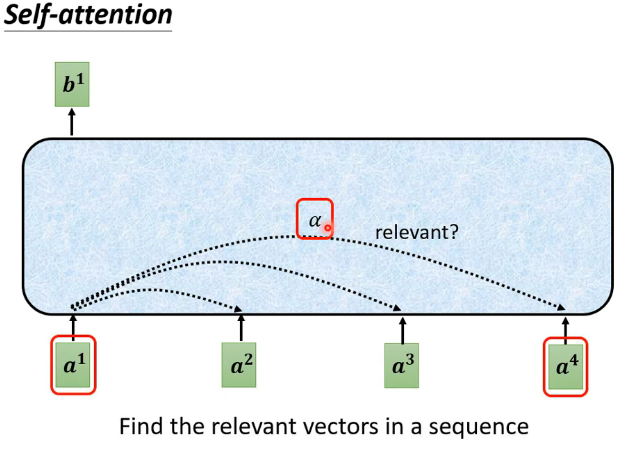

  - ​	alfer（关联性）怎么计算？

    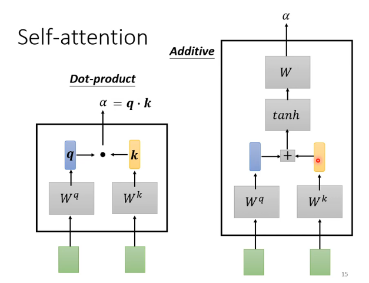

    一般用左边，transformer里面也是用左边的

  - 具体计算过程：

    计算关联性：

  	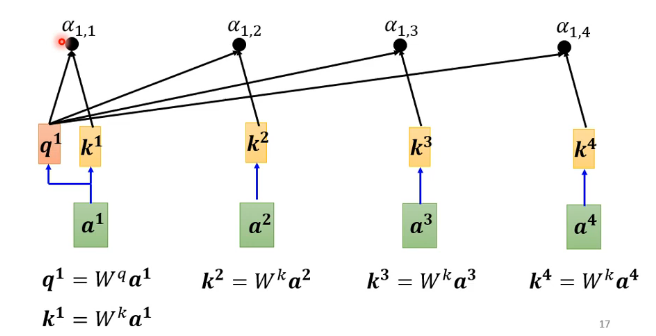

  	​	

  	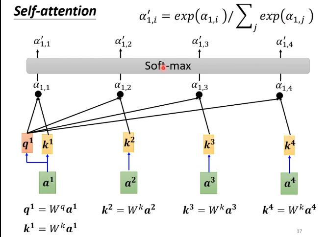

  	不一定使用Soft-max，也可以relu

  - 得到b^1^
  
    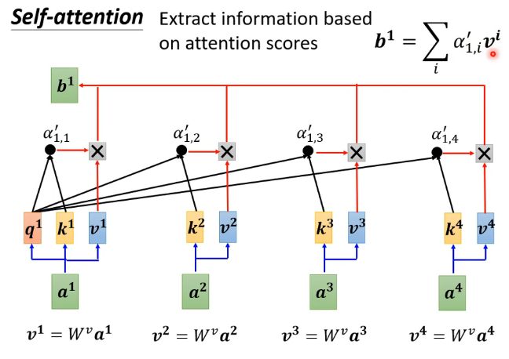

## P11_Self-attention(下)

计算b~2~

这里，α^'^ 应该是经过了softmax的。

Q、K、V

α的计算过程

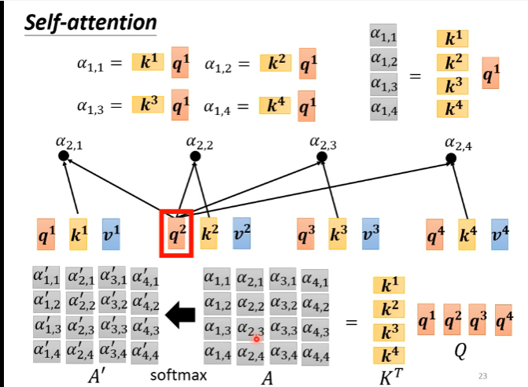

O是attention矩阵

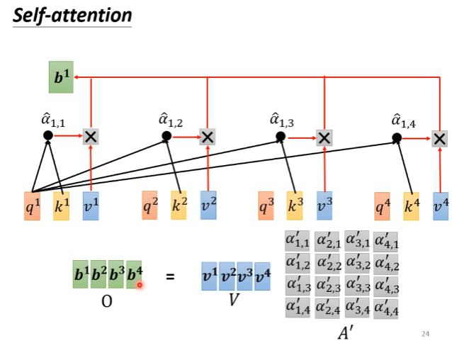

### Muti-head Self-attention

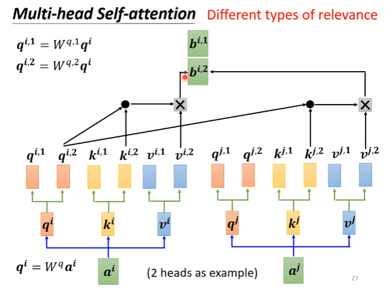

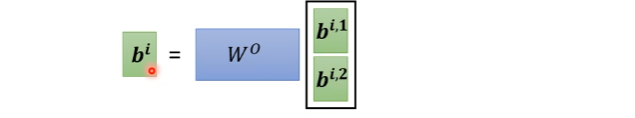

多头注意时：对应头做点积运算，最后拼接得到b^i^

### Positional Encoding

> 添加序列位置信息（可选）
>
> 为每一个位置设置一个vector e^i^  (i代表位置，类似独热，合起来就是矩阵)

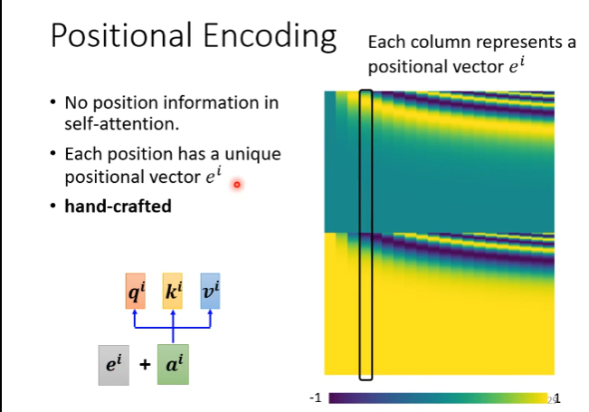

### bert

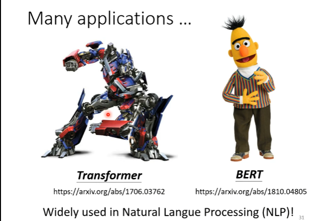

### Truncated Self-attention

> 考虑一个小范围位置，加快计算速度

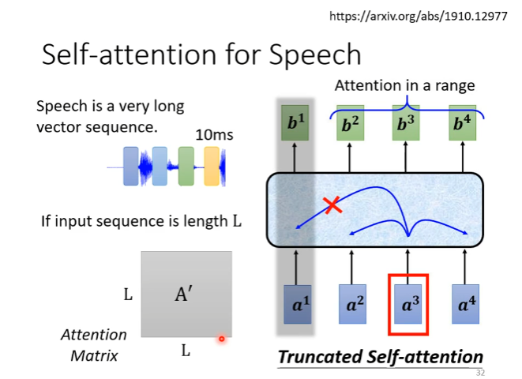

### 影像处理

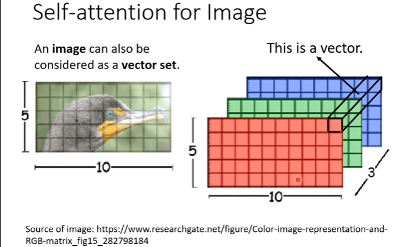

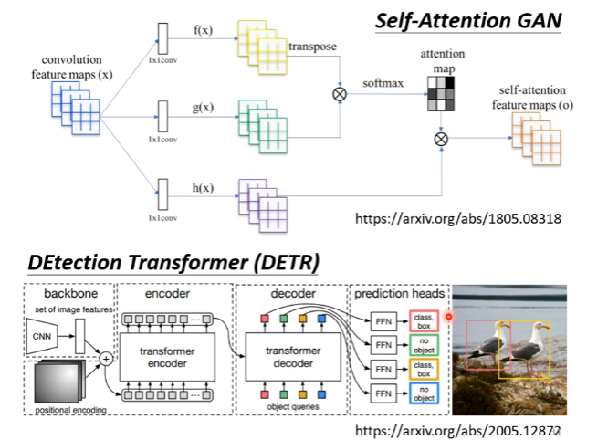

### Self-attention && CNN

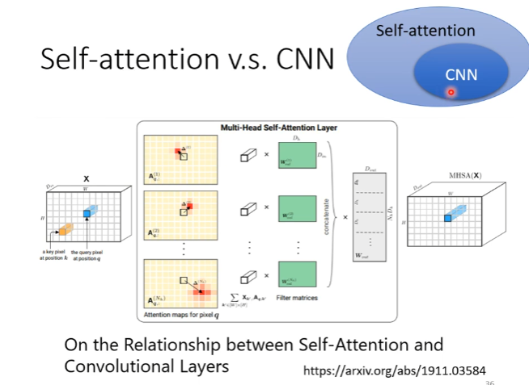

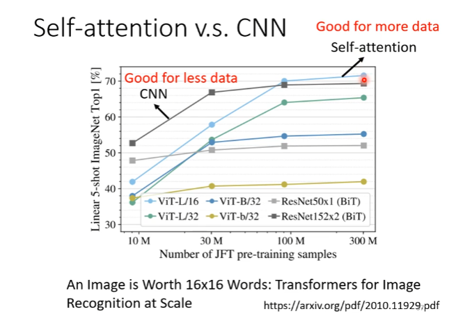

self-attention需要大量训练样本

从弹性上分析，self-attention的弹性更大，需要更多的数据，训练样本少的时候容易overfiting 。而CNN相反，弹性较小。

### Self-attention && RNN

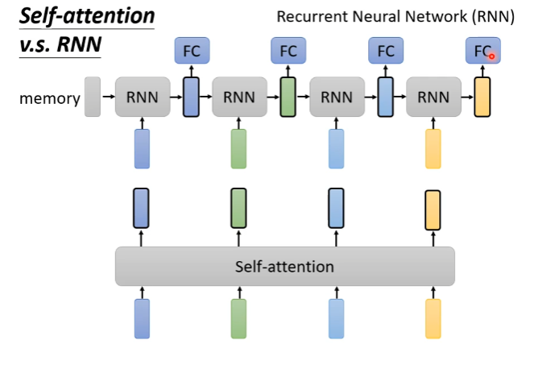

RNN串行、self-attention并行

RNN双向时，相当于考虑了整个序列，而不是输入以前的序列

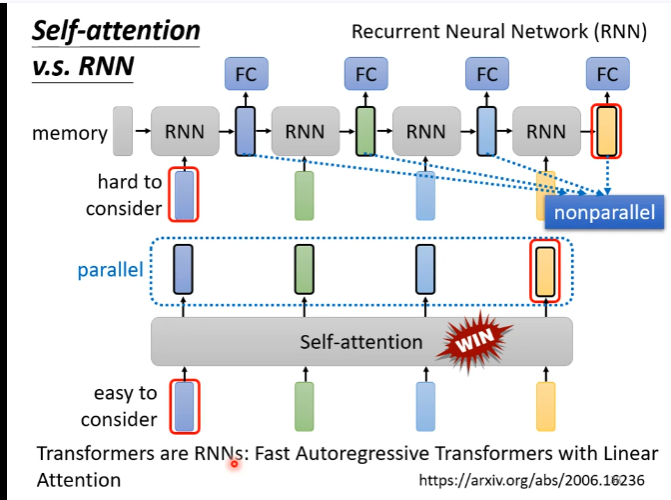

### RNN

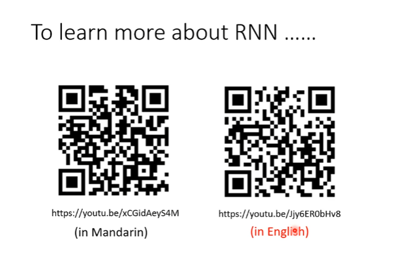

### Graph处理

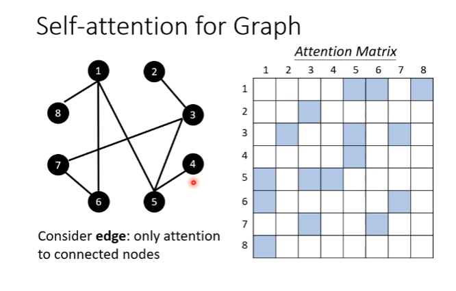

之间的关系：

### GNN（Graph ... ...）

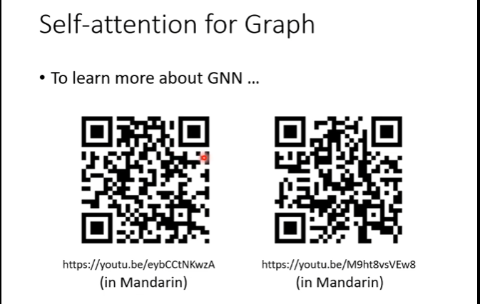

### 变型

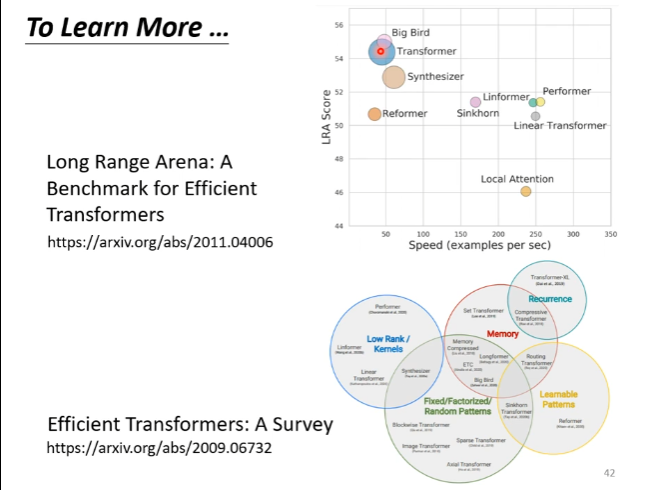