[TOC]

# Transformer

## P27-Encoder

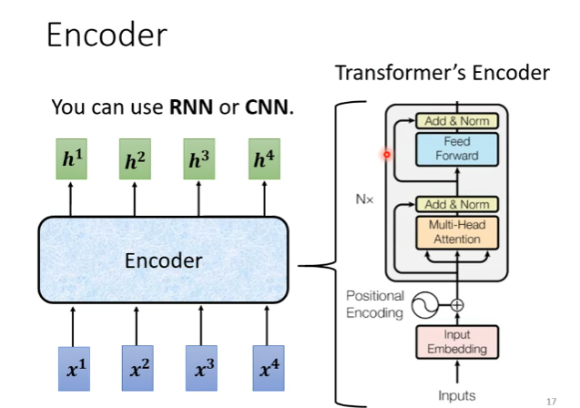

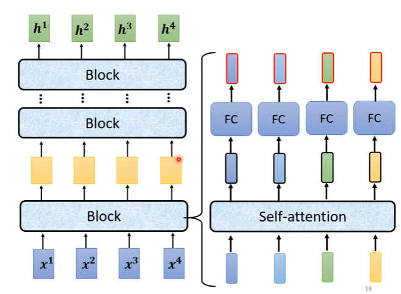

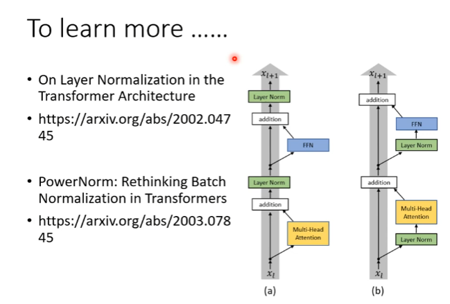

## P28-Decoder

> 两种decoder：
>
> 1. Autoregressive

### Autoregressive（AT）

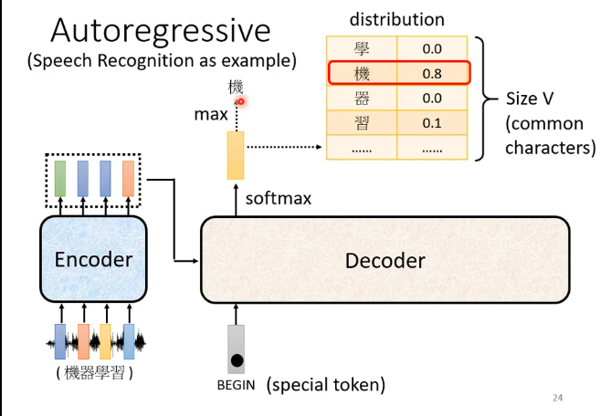

vocab.txt  :存储常见字

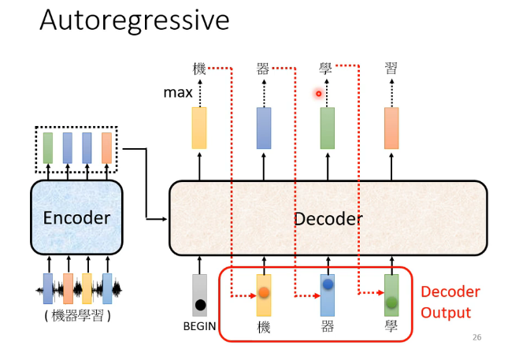

#### decoder内部结构

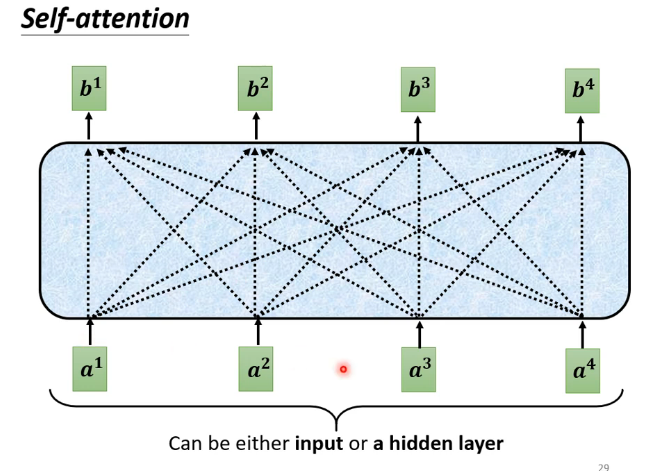

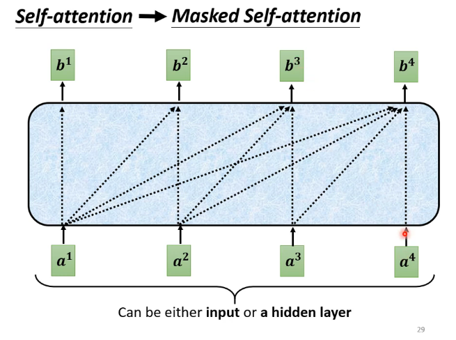

**Masked Self-attention：**每个b~i~只考虑当前位置前面的a，比如b~2~只考虑a^1^，a^2^两部分，不考虑a^3^，a^4^

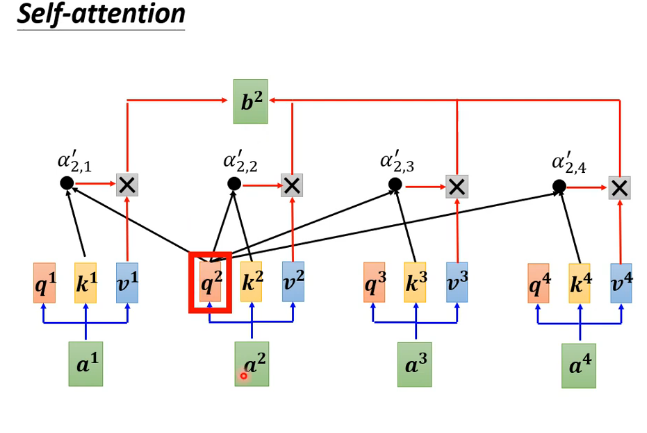

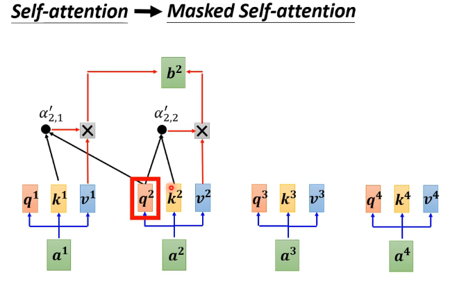

**Masked: **不考虑他右边的部分，只考虑左边的部分

**不知道输出的长度，可能一直输出，因此：**增加符号“END”表示停止

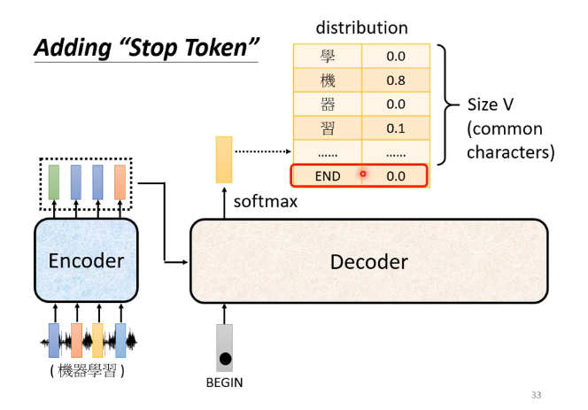

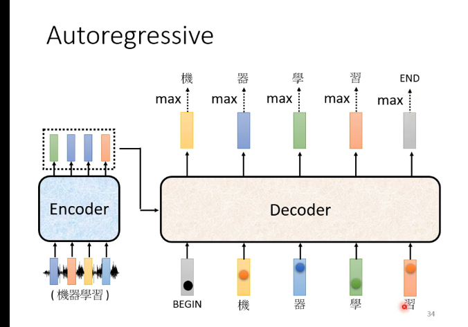

输入习，得到END的概率是max

### Non-autoregressive（NAT）

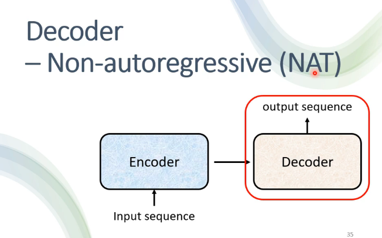

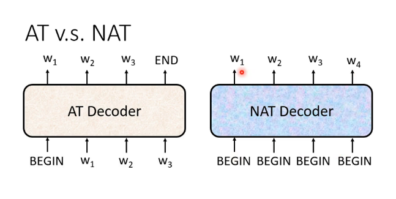

AT是串行；NAT是并行，可控的输出长度，但是通常效果不如AT好

**怎么知道输出长度：**2种方式

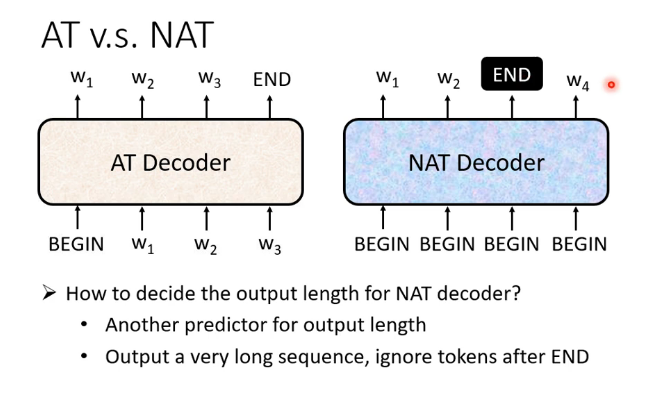

==NAT==

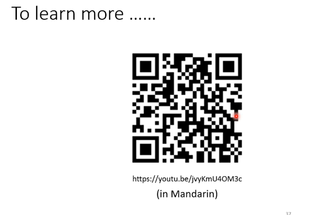

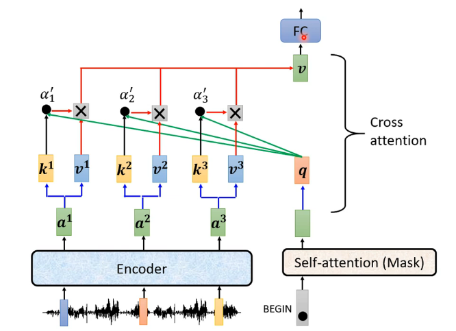

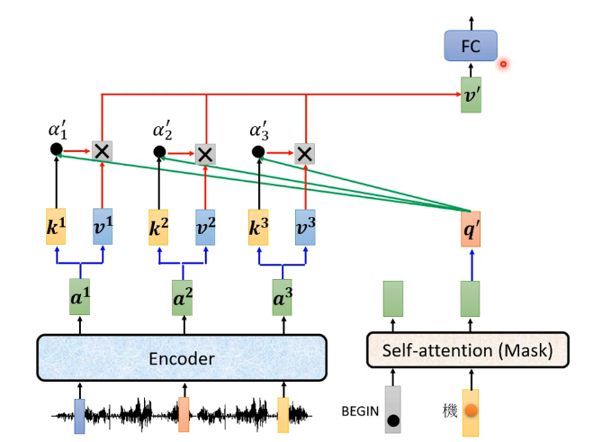
decoder的q和encoder的k、v

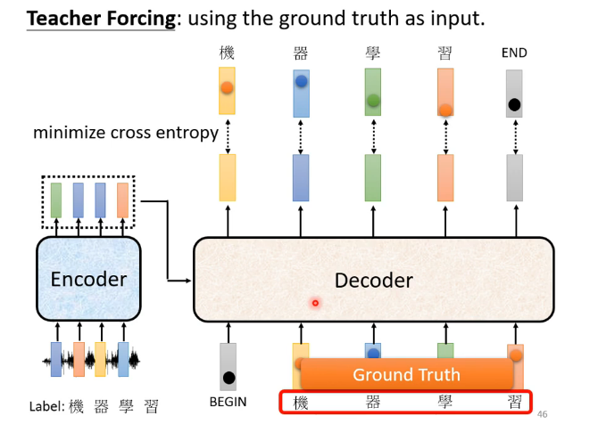

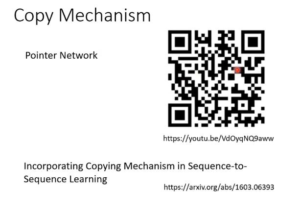

### Guided Attention

要求做attention的时候，有固定方式

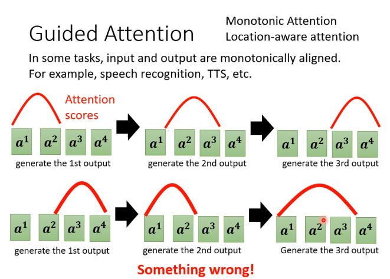

下面的attention方式对语音合成不适用，不是和上面一样，从左到右

### Beam Search

有时有用、有时没用

### Metrics

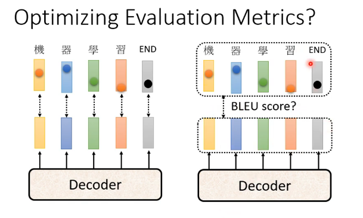

使用BLEU score判断两个句子，越高越好

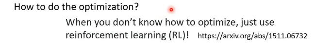

**使用RL硬做**

### exposure bias

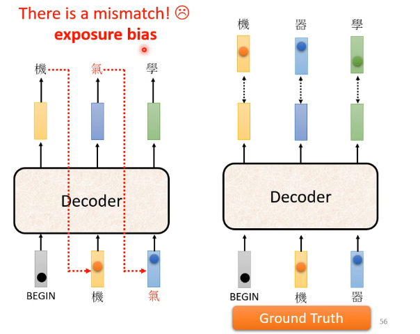

训练的时候，它输入的永远是正确的，但是，测试的时候，预测的不一定是对的，就会一直错

#### Scheduled Sampling

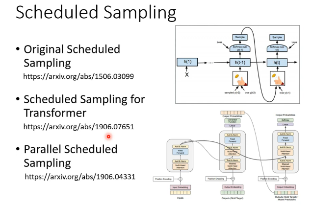

