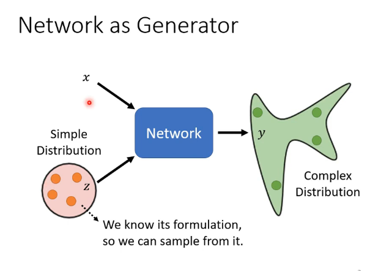
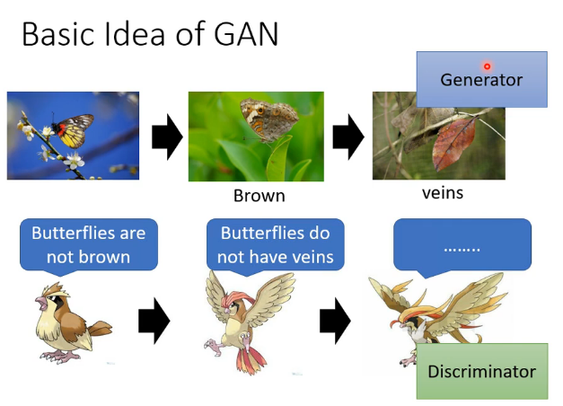
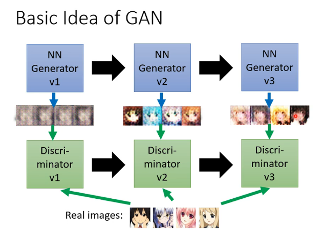
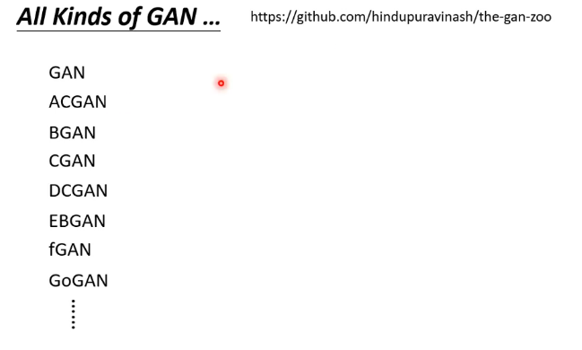
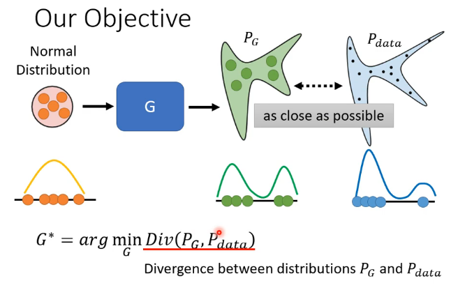
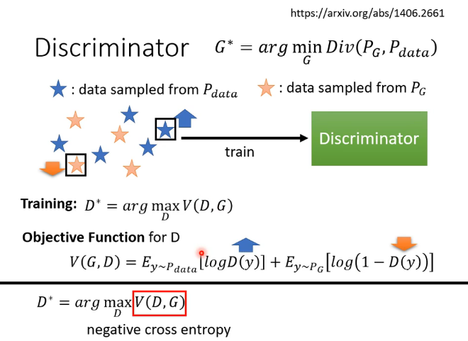
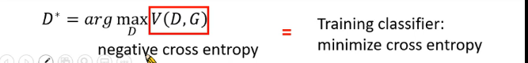

[TOC]

# GAN(生成式对抗网络)

## P30-基本概念

每次输入一个x，就要**加上**一个随机变量Z，z属于一个简单分布，比如高斯分布

**Generator:**

**Discriminator:**

两者反复迭代

**GAN-zoo**

## P31-理论介绍与WGAN

Divergence：评价指标，衡量两个分布之间的相似度，越小越相近

P~G~：预测的数据

P~data~：真实数据

distribution的Divergence很难算，算不出来，因此，使用他们的sample

normal distribution 

看到真的图（蓝色），给高分，看到生成的图（黄色），给低分

类似二分类来判断的思路

相似，很小的maxV；

### Gan 训练技巧

#### JS Divergence

#### Wasserstein distance

earth mover:推土机

把P变成Q；左边距离少，右边大

这里的X是指label，输出的图片

