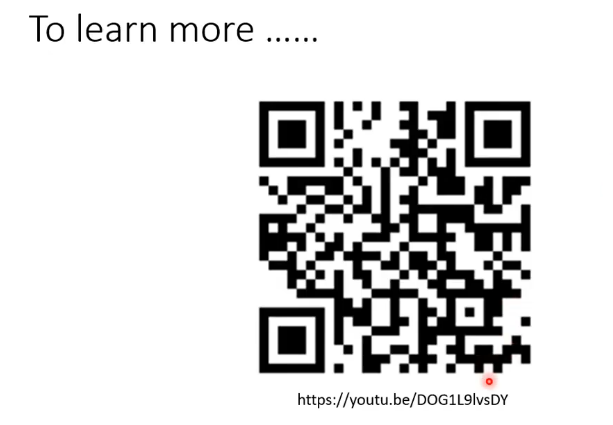

[TOC]

# self-supervised learning

**监督和自监督：**

监督：带有label y_hat；

自监督：无监督的一种，将没有标注的样本X分为两部分，一部分用于model的输入，另一部分作为学习目标，使得y_pre与其接近

# BERT：transformer encoder

输出是所有的可能出现的字的对应分数

湾---》one hot ---》 minimize cross entropy

yes/no: 判断句子是否相接；但是似乎这个没什么用

做下游任务

任务集GLUE：包含9个任务，在这里微调，看看9个模型的平均正确率如何，代表得到model的性能

性能结果

取CLS 经过Linear对应的向量，进行分类

与黄色向量做内积，得到答案的起始位置是2

与蓝色向量做内积，得到答案的结束位置是3

# GPT series

> bert 做填空题
>
> gpt 做预测接下来的部分

类似transformer的decoder

**GPT做翻译的方式：**

## learn more

**GPT3：**

## self-supervise 资料

## Speech GLUE

nlp基准资料库，有九个下游任务，再去平均，代表bert的好坏

# 自编码器（Auto-encoder）

**自监督学习框架：（使用没有label的资料，也可以做下游任务）**

## 基本概念

（vector：embedding、represention、code）

（维度变化：高维经过decoder变为低维）

**输入加入noises，最后还原成原图**

reconstruction：重建；还原

## 领结变声器与更多应用

### feature disentangle

哪些维度代表哪些资讯，比如内容、说话的是谁

### 应用：voice conversion 声音转换

**具体实现步骤：**

### text  as representation

**使用了gan的思想，gan让它可读**

### generator

**把decoder单独拿来做generator**

### compression

Lossy：会失真

### anomaly detection异常检测

**看是否与训练资料相似**

==适用场景==：容易收集到正常资料，不容易收集到异常资料

## learn more

==维度减少：==

==异常检测：==

