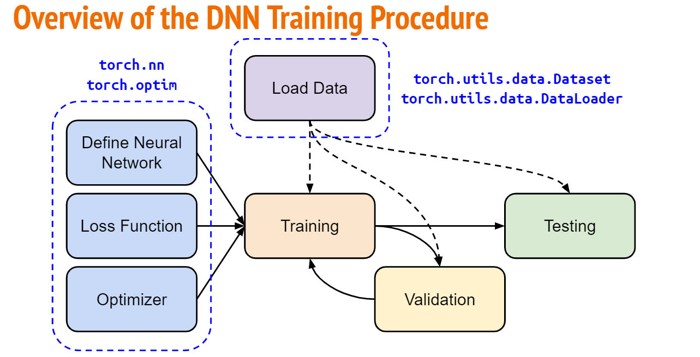
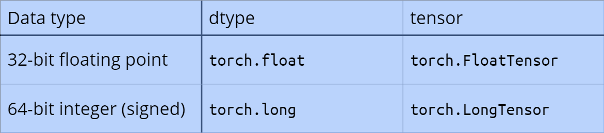
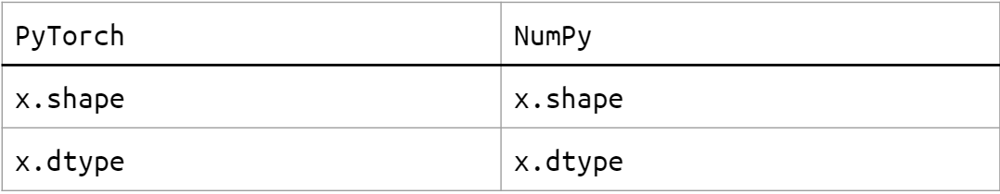
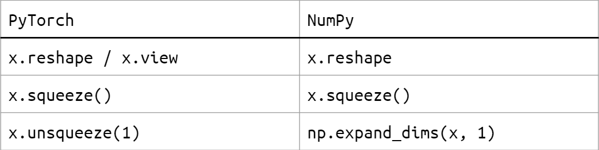
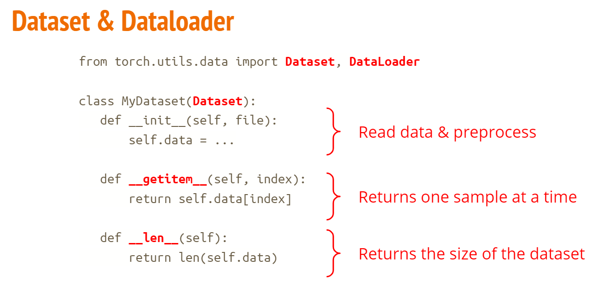
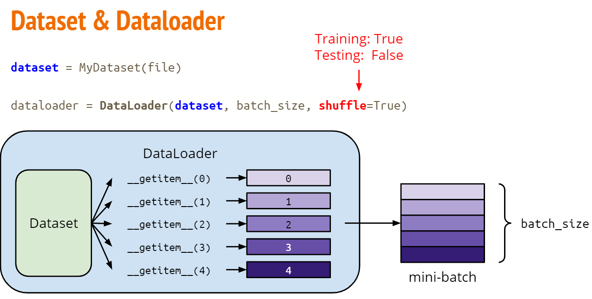
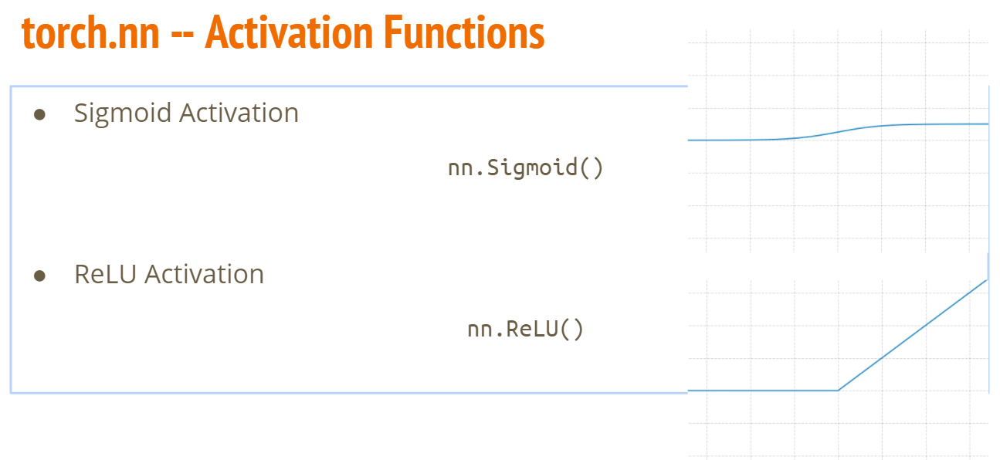
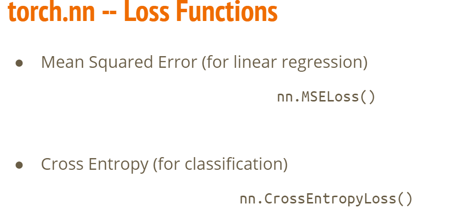
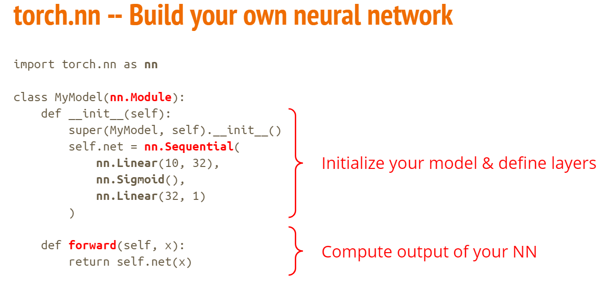
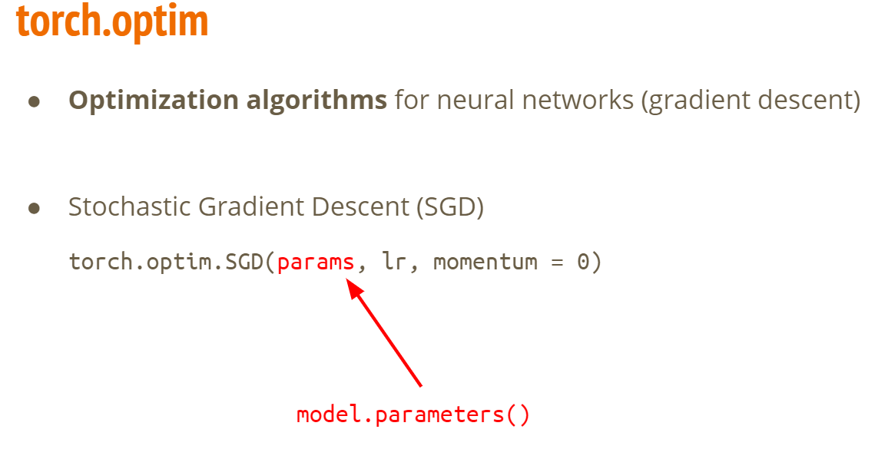

[TOC]


# pytorch




## Tensor

- 数据类型

  

- shape: **dim** in PyTorch == **axis** in NumPy

- Operates

  - **Unsqueeze**: expand a new dimension
  - **Transpose**: transpose two specified dimensions
  - **Unsqueeze**: expand a new dimension
  - **Cat**: concatenate multiple tensors
  - Addition	z = x + y	
  - Subtraction	z = x - y	
  - Powery = x.**pow(2)**
  - Summationy = x.**sum()**
  - Meany = x.**mean()**

- pytorch and numpy

  - ​	Attributes

    

  - maniputation

    

- device
  - x = x.**to(‘cpu’)**
  - x = x.**to(‘cuda’)**
  - 检测是否是NVIDA GPU：torch.cuda.is_available()
  - 多GPU： ‘cuda:0’, ‘cuda:1’, ‘cuda:2’, ...

## torch

- dataset

  

- dataloader

  

- activation function

  

- loss

  

- built

  

- optim

  

## train & test

```python
"""
read data via MyDataset
put dataset into Dataloader
contruct model and move to device (cpu/cuda)
set loss function
set optimizer
"""
dataset = MyDataset(file)
tr_set = DataLoader(dataset, 16, shuffle=True)
model = MyModel().to(device)
criterion = nn.MSELoss()
optimizer = torch.optim.SGD(model.parameters(), 0.1)

```

```python
"""
iterate n_epochs
set model to train mode
iterate through the dataloader
set gradient to zero
move data to device (cpu/cuda)
forward pass (compute output)
compute loss
compute gradient (backpropagation)
update model with optimizer
"""
for epoch in range(n_epochs):
    	model.train()
    	for x, y in tr_set:
        	optimizer.zero_grad()
        	x, y = x.to(device), y.to(device)
        	pred = model(x)
        	loss = criterion(pred, y)
        	loss.backward()
        	optimizer.step()

```

```python
"""
set model to evaluation mode

iterate through the dataloader
move data to device (cpu/cuda)
disable gradient calculation
forward pass (compute output)
collect prediction
"""
model.eval()
preds = []
for x in tt_set:
    x = x.to(device)
    with torch.no_grad():
        pred = model(x)
        preds.append(pred.cpu())

```

## save and load modle

```python
# Save
torch.save(model.state_dict(), path)
# Load
ckpt = torch.load(path)
model.load_state_dict(ckpt)

```

## more

- torchaudio
  - speech/audio processing
- torchtext
  - natural language processing

- torchvision
  - computer vision

- skorch
  - scikit-learn + pyTorch


## Useful github repositories using PyTorch

- [Huggingface Transformers](https://github.com/huggingface/transformers) (transformer models: BERT, GPT, ...)

- [Fairseq](https://github.com/pytorch/fairseq) (sequence modeling for NLP & speech)
- [ESPnet](https://github.com/espnet/espnet) (speech recognition, translation, synthesis, ...)
- Many implementation of papers...


## ref

https://pytorch.org/


https://github.com/pytorch/pytorch


https://github.com/wkentaro/pytorch-for-numpy-users


https://blog.udacity.com/2020/05/pytorch-vs-tensorflow-what-you-need-to-know.html


https://www.tensorflow.org/https://numpy.org/