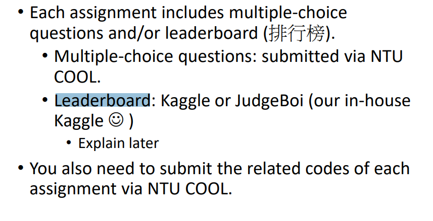
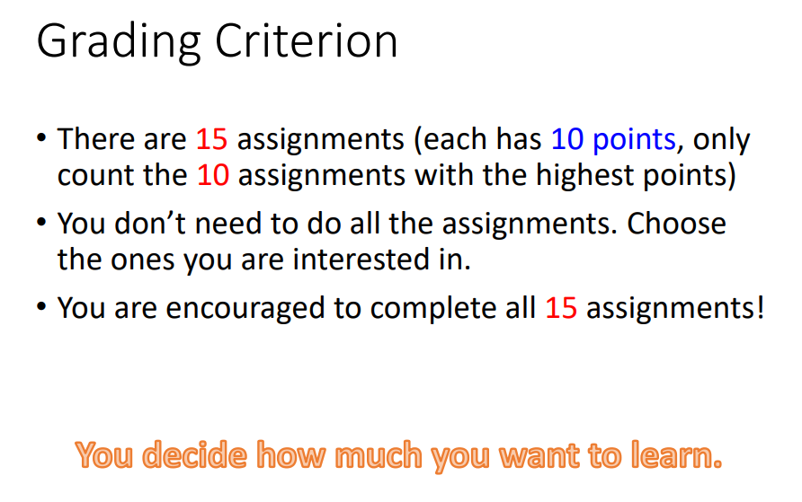
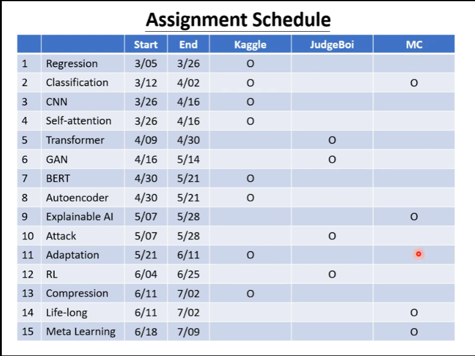
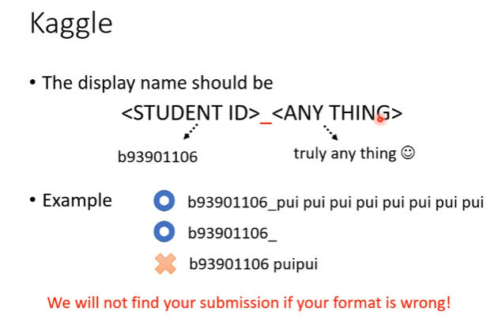
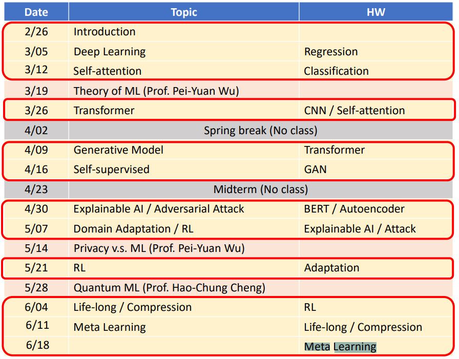

[TOC]

# learn

## info

[youtube机器学习课程频道](https://www.youtube.com/c/HungyiLeeNTU)

[bilibili机器学习课程频道](https://www.bilibili.com/video/BV1Wv411h7kN)

[github](https://github.com/ga642381/ML2021-Spring)

## note

上课时间：2：20p.m. - 6:20 p.m., Friday

## assignment

kaggle作业；kaggle（JudgeBoi Similar）

上课时间表：

