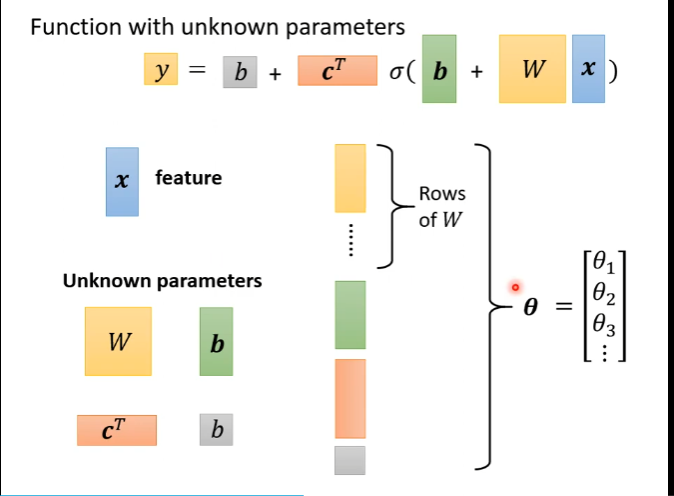
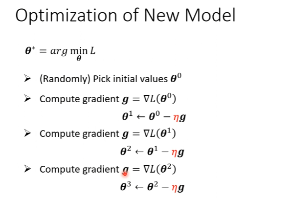
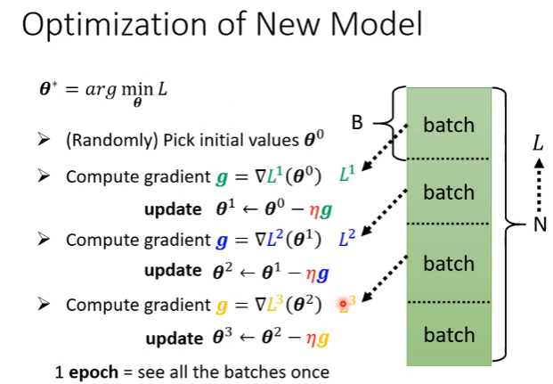
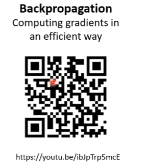

[TOC]

# week1  note

机器学习的任务：

- 回归问题（regression）

- 分类问题（classification）
- Structured Learning：产生有结构的东西

梯度：

- 梯度更新到0时，二维来看就是斜率，就不更新了，有可能是局部最低

评价指标：

- [AUC and AUPR](https://www.jianshu.com/p/848838ecbc2d)

激活函数：逼近复杂的函数

参数：

优化模型：

直到梯度是0就结束了

实际的做法，加了batch：

θ^n^: 表示的是参数==向量==，每计算一个batch就更新一次所有参数

update： 一个epoch更新了N/batch_size次

Backpropagation：反向传播算法

