[TOC]

# week2-类神经网络训练不起来

## lecture2-1  

通常步骤：

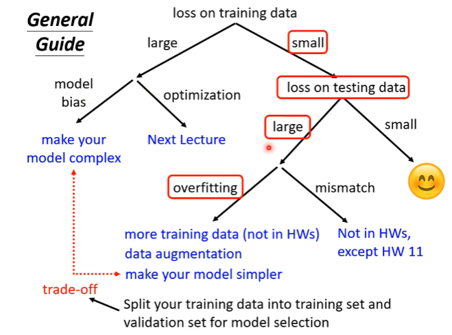

overfitting解决办法：

- 增加训练资料
- 数据增广（data augmentation）

数据集划分：

mse：mean squared error

- cross validation

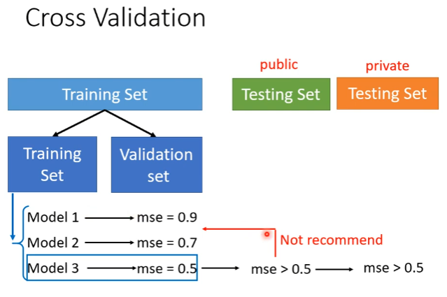

- k-flod cross validation

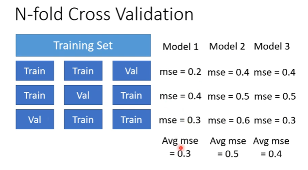

 

## optimization fails

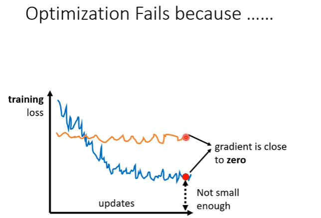

gradient=0时，loss就不再下降了

有以下情况：

- critical point：gradient=0【一个统称】

- local minima
- local maxima
- saddle point（鞍点）：gradient=0，不是local minima，也不是local maxima

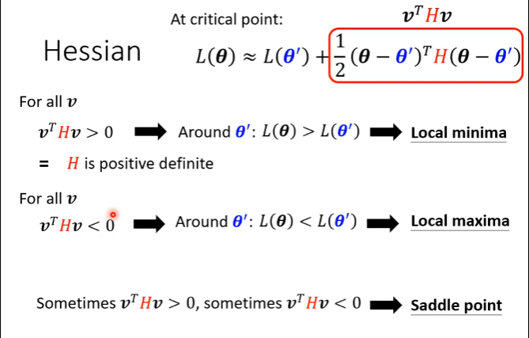

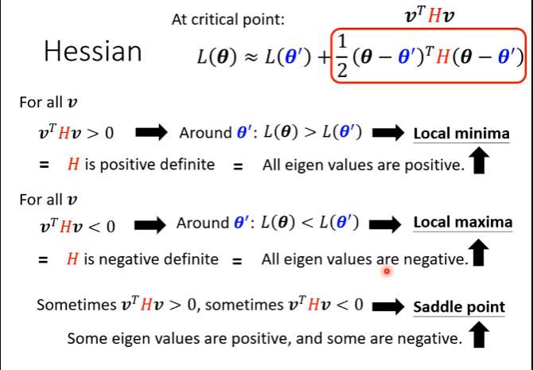

elgen value:特征值

H： Hessian

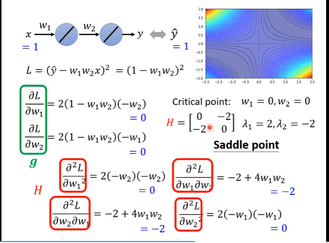

## lecture2-2 batch and momentum（动量）

### batch

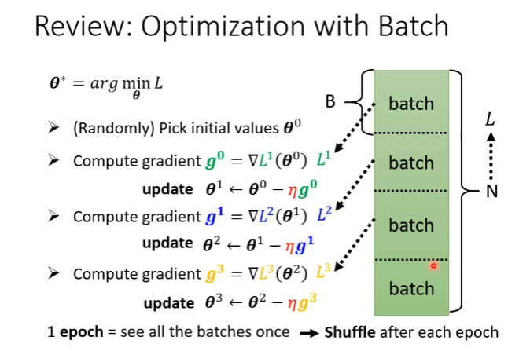

shuffle：打乱数据集，每epoch分的batch中的数据不一样

batch_size=n：每看n个数据，参数就update一次；

==更小的batch_size性能更好；因为大的batch_size会optimization fails==

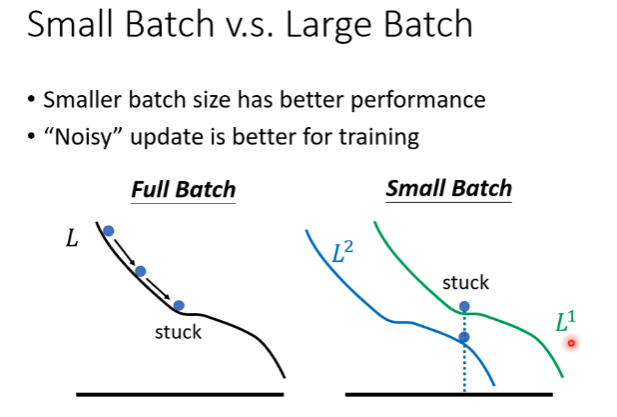

Full Batch：gradient=0，就卡住了

small batch：gradient=0，换下一个epoch，此时不一定卡住，会继续计算

最终对比：

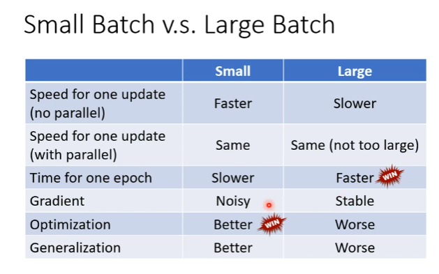

### momentum

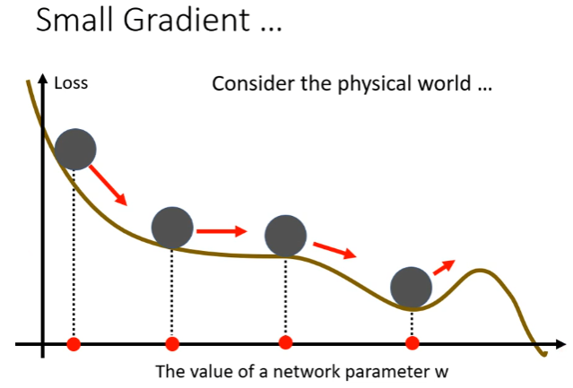

动量一定大的时候，球不一定会停在鞍点或者局部最低点

计算方式：

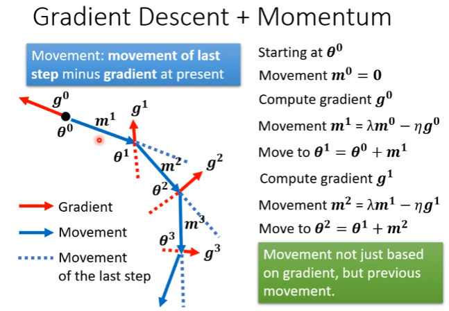

朝gradient的反方向运动

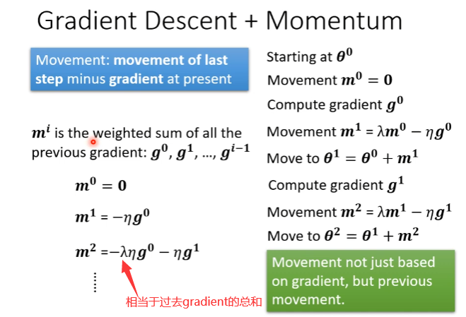

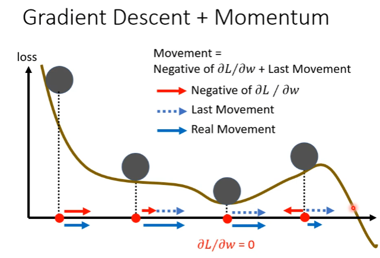

