[TOC]

# week2-类神经网络训练不起来

通常步骤：

overfitting解决办法：

- 增加训练资料
- 数据增广（data augmentation）

数据集划分：

mse：mean squared error

- cross validation

- k-flod cross validation

 

## P5-optimization fails:局部最小值和鞍点

gradient=0时，loss就不再下降了

有以下情况：

- critical point：gradient=0【一个统称】

- local minima
- local maxima
- saddle point（鞍点）：gradient=0，不是local minima，也不是local maxima

elgen value:特征值

H： Hessian

## P6-optimization fails:batch and momentum（动量）

### batch

==直观认为，真实结果并不是这样：==

Batch_szie = N ：训练时间长，准确

Batch_szie = 1 ：训练时间短，不够准确，每个epoch需要更新N次

**花费时间：**

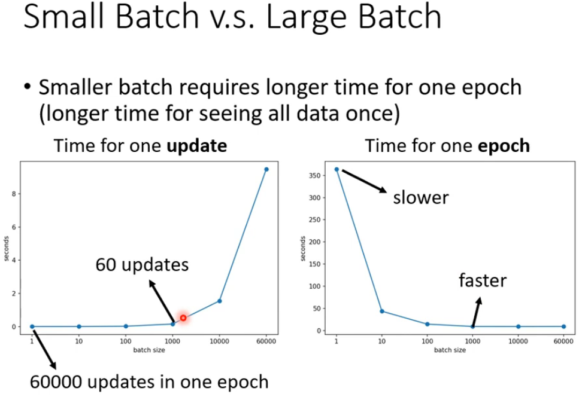

batch_size=1000时，时间花费较少。==即并不是batch_size越大，花费时间越小==

**训练结果（准确率）：**

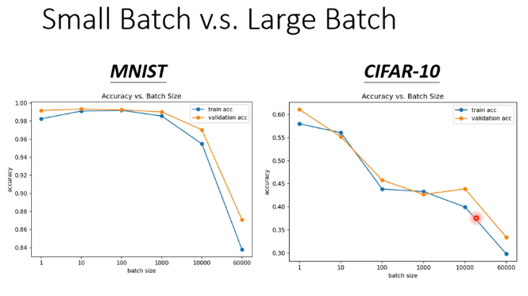

batch_size越大，准确率反而越来越差。==更小的batch_size有更好的性能表现==

**原因分析：**

Full Batch：遇到鞍点时，此时gradient=0，停止训练

small Batch：每次update时，loss Function都是略有差异，那么在一次update中（如用L1计算梯度）遇到鞍点时，卡住了，但在另一次update中（如用L2计算梯度），没有卡住，还是trainable。

**small batch 对于 test data 表现更好**

**原因分析：**

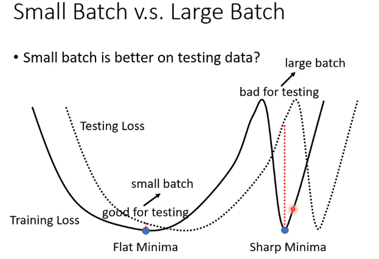

small batch更容易得到flat minima，（假设train和test发生了平移）意味着其flat minima的附近，train和test的loss值不会相差很大

large batch会更容易得到sharp（急剧的，锐） minima

**总结：**

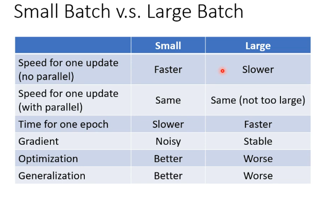

### momentum（动量）

> 在gradient基础上，再给一个momentum，矢量相加，在gradient为0时，依然可以继续训练

示意图：

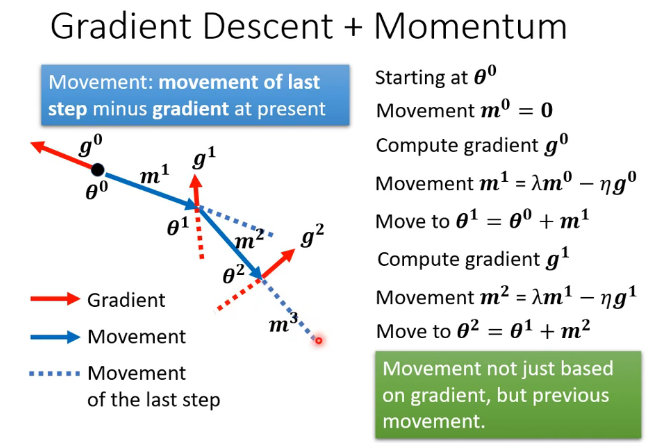

## P7-optimization fails:自动调整学习率（learn rate）

> 学习率一定时：大一点容易左右横跳，小一点又很难移动。
>
> 需求：平滑的地方希望步子大一点，陡峭的地方希望步子小一点，这样就不会左右横跳

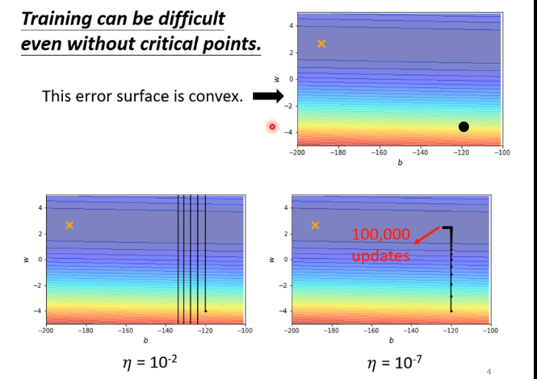

因此，需要==自适应学习率==

### 方法一：Root Mean Square【均值平方再开根】

计算步骤：

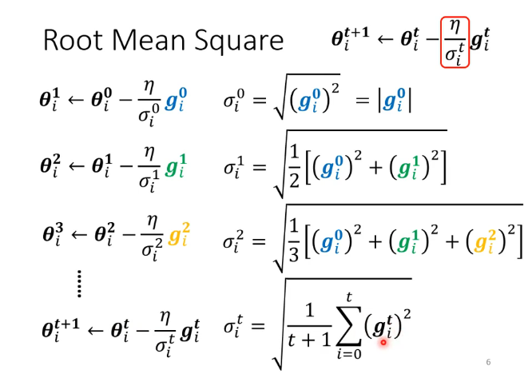

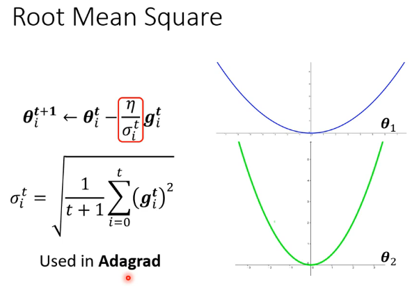

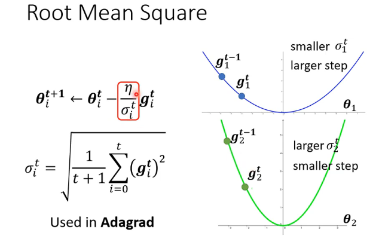

如果参数theta比较小，则gradient比较小，会得到更小的deta，则学习率更大，update的step就大

### 方法二：RMSProp

计算步骤：

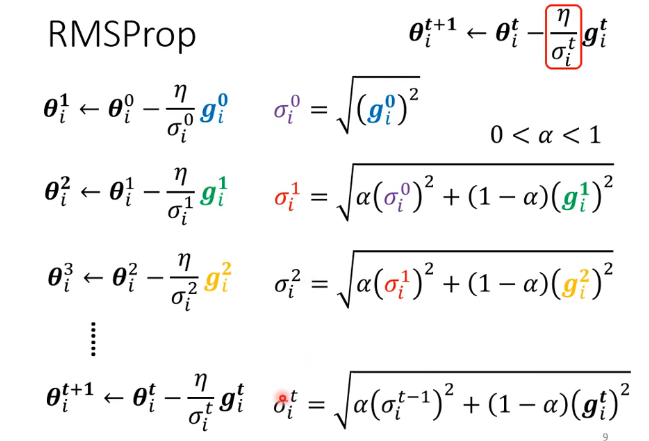

分析：

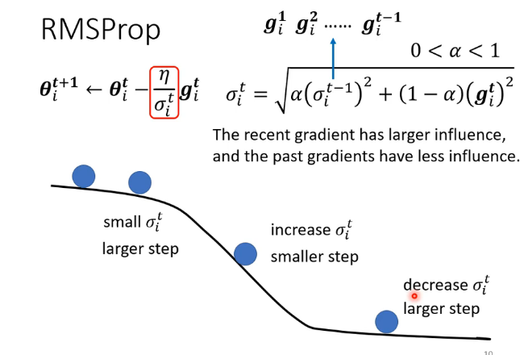

当grad非常大的时候（即中间陡峭部分），deta增大，学习率就会变小，及时刹车，使用更小的步伐。

集成：

## P8-optimization fails:Loss Function

长版本：

