[TOC]

# week3

> p9_卷积神经网络（CNN）
>
> p10_自注意力机制（Self_attention）

## p9_卷积神经网络（CNN）

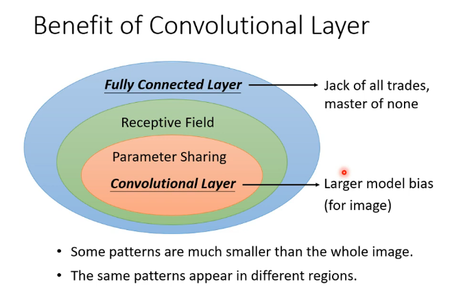

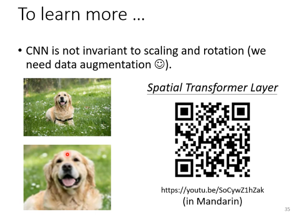

==transformer==

## P10_自注意力机制（Self_attention）

### input

文本方式：

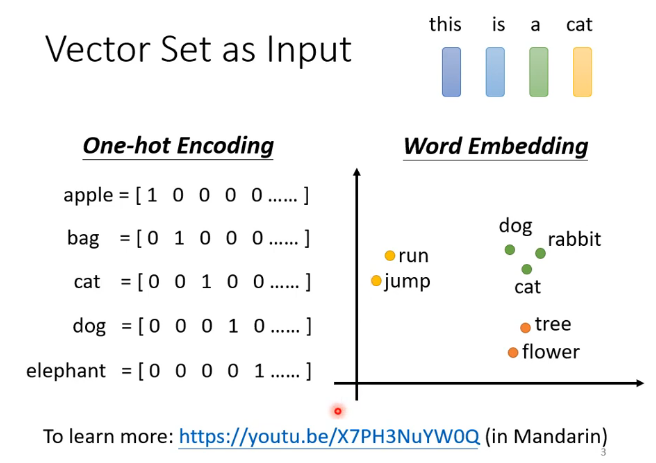

learn more: ==word Embedding==

语音方式：

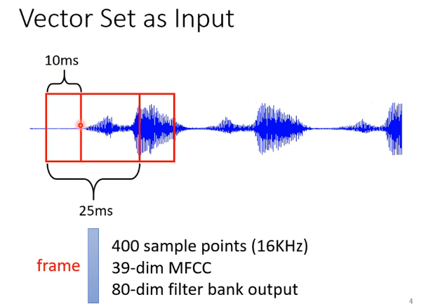

图（graph）方式：

每个node作为一个节点，用向量表示信息

### output

- 每个向量都有一个输出（输入输出数目一样的）

  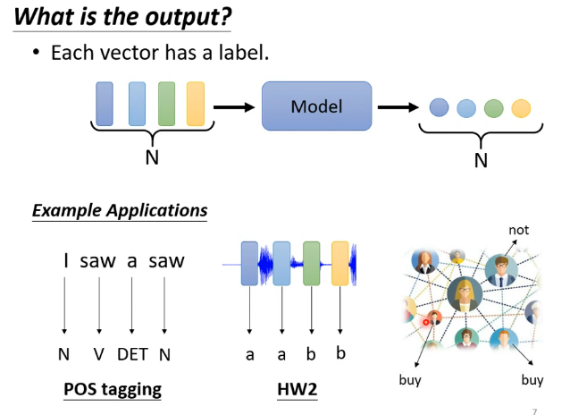

- 整个序列只有一个输出（类似分类问题）

  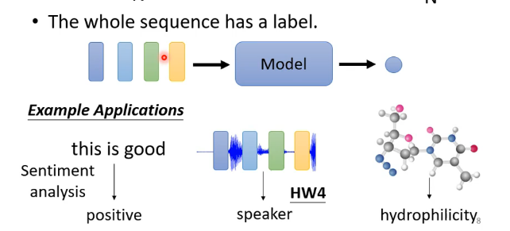

- 机器自己决定输出label的数量（seq2seq）

  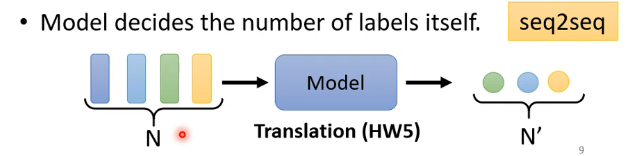

### self_attention

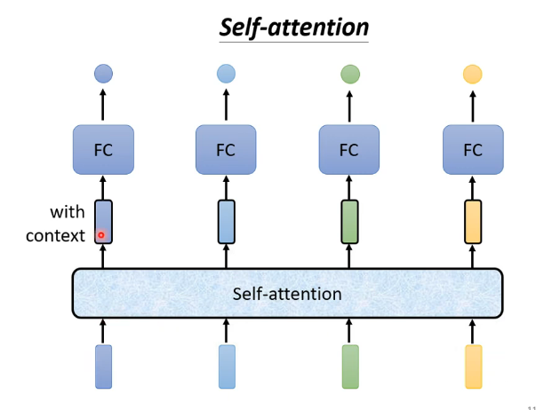

经过self_attention得到的输出，就考虑了整个seq的后得到的结果。

交替使用**self_attention**

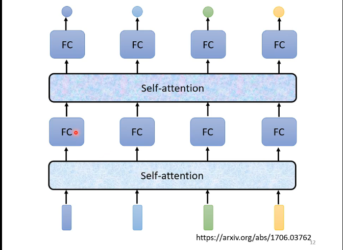

paper：Attention is all you need  http://arxiv.org/abs/1706.03762

**内部结构：**

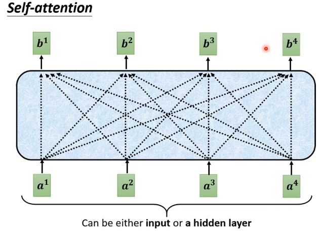

计算b^1^的过程：

- 根据a^1^这个向量，找出整个seq中哪个是最重要的，哪些跟判断a^1^是哪一个label是有关系的

  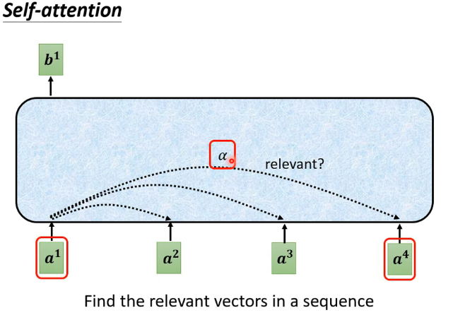

  - ​	alfer（关联性）怎么计算？

    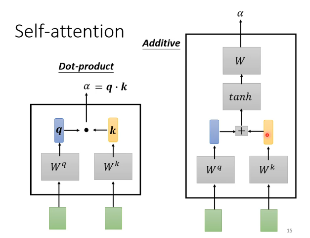

    一般用左边，transformer里面也是用左边的

  - 具体计算过程：

    计算关联性：

  	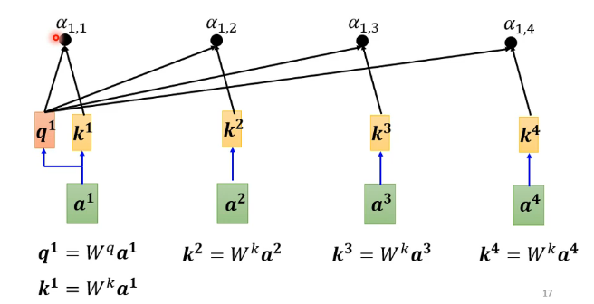

  	​	

  	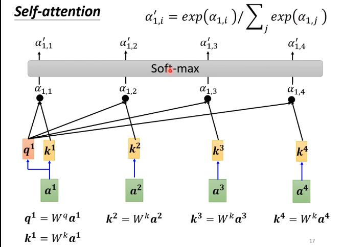

  	不一定使用Soft-max，也可以relu

  - 得到b^1^
  
    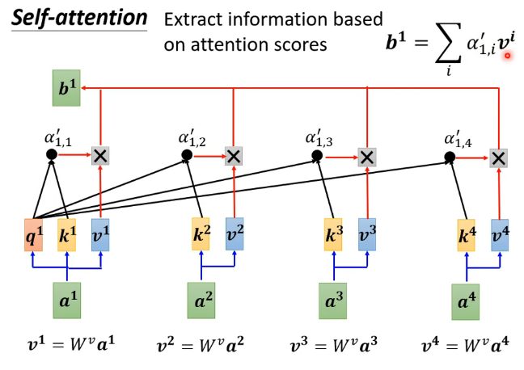